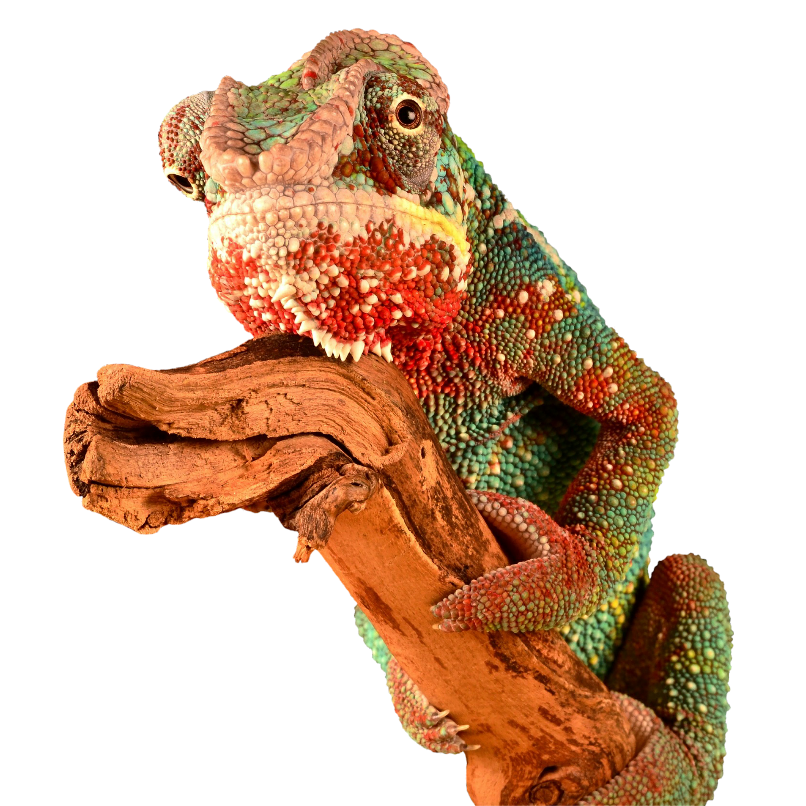

# Chamelib
## (Chameleons can look at two different directions at the same time).

[WIP. Work In Progress project (Alpha version)]

I love C++ and I want to use it everwhere, even in frontend applications:

  * Desktop (Qt).
  * Mobile (Cordova + Emscripten)
  * Web (Emscripten).
  * ...

DRY: Same business logic code everywere! I only need to recompile.

Although I don't want to write very common elsewhere frontend code such as:

    ...
    button->setText("Push me!"); /// Good! I want to set what the button says.
    ...
    button->setColor("#ff0000"); /// This is not my business (Get out of my code!).
    button->setWidth(100);       /// This is not my business (Get out of my code!).
    ...

Do you get my logic?

